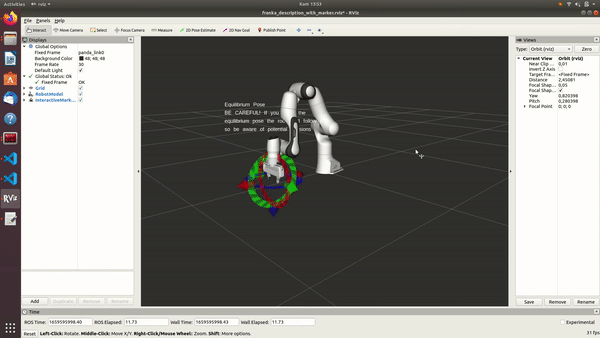

# Franka Hybrid Force Position Controller

This repository contains the packages for the hybrid force position controller written for the Franka Emika robot at the CLeAR Lab.
The controller can be used to conduct force-relevant physcial experiments such as cleaning tasks on a whiteboard, where the position of the end-effector can be manipulated while a normal force is applied to perform the cleaning successfully.

In addition to the hybrid force position controller that was designed, there are also additional controllers provided by franka_ros under the franka_example_controllers package in this repository that can be used.



## Controller Design

The controller was designed using a Proportional-Integral-Derivative (PID) control system for both its pose (position and orientation) and force domains. To couple the pose control with the force control, inverse kinematics was performed by accounting for the body Jacobian matrix of the robot at the end-effector frame (provided by Franka), the difference between the wrenches required for force and pose manipulations, and the gravitational forces.

## Setup

This repository is packaged as a catkin workspace, and the following steps are to be performed sequentially to set it up properly.
```
cd ~
git clone https://github.com/clear-nus/clear_control.git --recursive
cd src/robots/libfranka
mkdir build
cd build
cmake -DCMAKE_BUILD_TYPE=Release ..
cmake --build .
cd ~/clear_control/
rosdep install --from-paths src --ignore-src src -r -y --skip-keys libfranka
catkin_make -DCMAKE_BUILD_TYPE=Release -DFranka_DIR:PATH=~/clear_control/src/robots/libfranka/build
```
## Usage

### Launching the controller

Once the ```catkin_make``` command has completed successfully, the following commands can be launched from the terminal window to run the controller.

```
cd ~/clear_control
source devel/setup.bash
roslaunch franka_example_controller hybrid_force_position_controller.launch
```

This will launch an Rviz window visually depicting the configuration of the Franka robot as follows:

The pose of the end-effector can then be manipulated using the mouse cursor on the Rviz screen, which will correspondingly send the commands to the real robot to perform the exact same change in position/orientation.

**NOTE**: Do not drag the cursor too much in any direction as this may result in dangerous reactions from the real robot. Operate the controller smoothly to conduct experiments safely. 

### Changing the normal force

```
cd ~/clear_control
cd src/robots/franka_ros/franka_example_controllers/config
nano franka_example_controllers.yaml
```
Under ```hybrid_force_position_conroller```, change the ```desired_normal_force``` value to desired controller force value. Setting too high of a force is expected to cause controller limits to be exceeded.

### Tuning the controller parameters

To tune the force control parameters of the controller, perform the following steps sequentially.
```
cd ~/clear_control
cd src/robots/franka_ros/franka_example_controllers/config
nano franka_example_controllers.yaml
```
Under ```hybrid_force_position_conroller```, change the ```k_p_gain_force``` value to desired proportional force gain and ```k_i_gain_force``` to desired integral force gain. 
